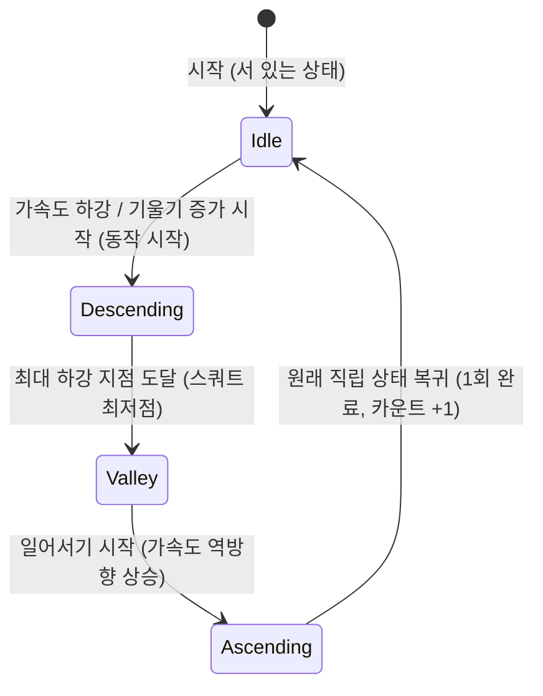

# Skill: Repetition Counter Tuning (반복 횟수 카운터 튜닝)

이 스킬은 센서 로우 데이터에서 가속도 크기(Magnitude)를 산출하고, 노이즈를 필터링하여 스쿼트 카운팅 유한 상태 머신(FSM)을 조정하고 감도를 설정하는 세부 튜닝 프로토콜을 규정합니다.

## 사용 시점
- 운동 감지 정확도(오탐지 또는 감지 누락)를 개선하고자 알고리즘 파라미터를 수정할 때.
- 신규 필터링 기법(예: 칼만 필터, EMA 필터)을 핵심 엔진에 도입하거나 파라미터를 조정할 때.
- 스쿼트 FSM 상태 변화 조건(임계치 값)을 재설정할 때.

## 수행 지침

### 1. 신호 전처리 파이프라인 수립
가속도계 원본 데이터는 고주파 노이즈와 미세 진동에 민감하므로 필터 적용이 필수적입니다.
- **가속도 크기(Magnitude) 산출**:
  기기의 방향(Orientation) 변화에 따른 왜곡을 줄이기 위해 중력이 제거된 선형 가속도 3축 벡터의 크기($Mag = \sqrt{x^2 + y^2 + z^2}$) 또는 중력 가속도가 포함된 경우의 크기 변동 폭을 기준으로 판단합니다.
- **로우패스 필터(LPF) 적용**:
  스쿼트는 보통 1회 동작에 1.5초~3초가 소요되는 저주파 신호 영역에 위치합니다. 따라서 컷오프 주파수를 낮게 잡아 지수 이동 평균(Exponential Moving Average)을 적용합니다.
  $$y[n] = \alpha \cdot x[n] + (1 - \alpha) \cdot y[n-1]$$
  (여기서 $\alpha$는 기본 `0.1` ~ `0.2` 수준으로 설정하여 노이즈를 부드럽게 감쇄시킵니다.)

### 2. 스쿼트 카운팅 FSM 설계
바지 앞주머니에 기기가 세로로 꼽혀 있을 때, 스쿼트 동작 시 허벅지가 수평에 가까워지면서 기기는 수평 방향으로 누웠다가 일어서면서 다시 수직으로 세워집니다. 이 기울기(자이로/가속도 pitch, roll 성분 또는 가속도 특정 축의 크기 변화)를 기반으로 FSM 상태를 관리합니다.

- **상태 정의**:
  - `Idle`: 서 있는 상태 (기울기 정상)
  - `Descending`: 주저앉는 중
  - `Valley`: 완전히 앉은 최저점 지대 유지
  - `Ascending`: 일어나는 중
- **오탐 방지 임계 장치**:
  - `Idle` -> `Descending`으로의 전이를 트리거하기 위해서는 가속도 크기 또는 피치(Pitch) 각도의 변화폭이 최소 임계치(`THRESHOLD_DOWN`) 이상으로 내려가고 이 상태가 최소 프레임 시간(Debounce window, 약 200ms) 이상 유지되어야 합니다.
  - 최저점에서 복귀 시에도 `THRESHOLD_UP`을 충족해야 하며, 스쿼트 1회 수행에 필요한 최소 주기(예: 800ms 이하의 너무 빠른 움직임은 무효 처리) 제약 조건을 걸어 걷기나 뛰기 동작과의 유사 노이즈를 걸러냅니다.
